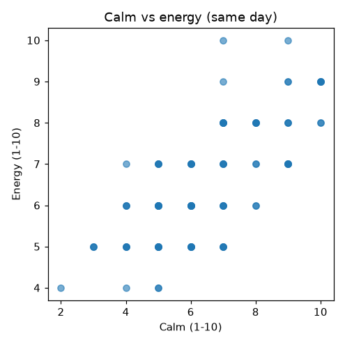

# Garmin Health ETL

**An n=1 self-experiment toolkit: pull my Garmin data, join how I actually felt
each day, and find what's really driving my energy.** (The "ETL" is the
plumbing — extract from Garmin, store in SQLite — but the point is the analysis
on top.)

It started from a simple frustration: I feel tired in ways my watch's "recovery"
scores don't explain, so I wanted to test that directly instead of guessing. The
tool pulls daily wellness metrics and workouts from Garmin Connect, normalizes
them into SQLite, joins a Google Form mood/energy log on date, and runs lagged
correlations + natural-experiment comparisons into a markdown report with charts.

> Everything in this public repo runs on a **synthetic** sample dataset. Real
> health data stays local and gitignored; credentials come from environment
> variables and are never committed.

## What it found (on the synthetic sample, mirroring the real result)

See [`examples/report.md`](examples/report.md). The headline pattern the tool is
built to surface:

- **Subjective calm is the strongest same-day correlate of felt energy** — the
  lever the watch can't directly see.
- **Garmin recovery metrics (HRV, sleep score, Body Battery) barely track felt
  energy.** The watch measures recovery, not fatigue.
- **Prior-day movement shows no meaningful next-day recovery benefit.**
- **Overnight SpO2 dips below 85% on roughly half of nights** — the one concrete,
  data-backed flag.



## Pipeline

```text
                 (env credentials)
                        │
   garmin-health-etl extract ──► JSON ──► garmin-health-etl import-json ─┐
                                                                         ├─► SQLite ──► garmin-health-etl analyze ──► report.md + charts
   Google Form CSV ──► garmin-health-etl import-tracker ─────────────────┘                └─► garmin-health-etl export-psv / export-csv
```

## Install

Uses [`uv`](https://docs.astral.sh/uv/). The core ETL has **zero runtime
dependencies**; the extractor and analysis live behind optional extras.

```bash
uv python install 3.12
uv sync                      # core ETL only
uv sync --extra garmin       # + Garmin Connect extractor (python-garminconnect)
uv sync --extra analysis     # + analysis/charts (pandas, numpy, matplotlib)
uv sync --extra dev          # everything + ruff (for development)
```

## Quick start — the happy path

One command does the whole loop (import what you have, join, analyze). No Garmin
account needed for the demo — it runs on synthetic data:

```bash
uv sync --extra analysis
uv run --extra analysis garmin-health-etl generate-sample --output-dir sample
uv run --extra analysis garmin-health-etl report \
    --db health.db --garmin sample/sample_garmin.json --tracker sample/sample_tracker.csv
# -> writes report.md + charts/
```

With **your own data**, swap in your two files:

```bash
# export.json comes from `extract` (see "Auth & rate limits" below);
# tracker.csv is your Daily Health Tracker Form responses, downloaded as CSV.
uv run --extra analysis garmin-health-etl report \
    --db health.db --garmin export.json --tracker tracker.csv
```

That's it. Everything below is the individual steps `report` wraps, plus advanced
options — reach for them only if you want to run a stage on its own.

## Individual commands (what `report` wraps)

### `extract` — pull from Garmin Connect

Reads credentials from the environment (`GARMIN_EMAIL` + `GARMIN_PASSWORD`, or a
`GARMINTOKENS` cache dir) and emits the normalized JSON `import-json` consumes.
Every metric is fetched independently and missing data is null-filled — the run
never crashes because a given watch didn't report something.

```bash
export GARMIN_EMAIL="you@example.com"
export GARMIN_PASSWORD="..."
uv run --extra garmin garmin-health-etl extract --start 2026-01-01 --end 2026-03-31 --output export.json
```

**Auth & rate limits.** Garmin rate-limits its login endpoint by IP and returns
HTTP 429 if you log in too often (e.g. running `extract` repeatedly). Log in once
and cache the token so later runs reuse the session instead of re-authenticating:

```bash
# one-time: seed the token cache (run interactively if your account uses 2FA)
uv run python -c "import garth; garth.login('you@example.com','PASSWORD'); garth.save('$HOME/.garminconnect')"

# then point the extractor at the cache — no fresh login, no 429
export GARMINTOKENS="$HOME/.garminconnect"
uv run --extra garmin garmin-health-etl extract --start 2026-01-01 --end 2026-03-31 --output export.json
```

If you do hit a 429, wait ~15–60 minutes before retrying; repeated attempts reset
the cooldown.

### `import-json` — load normalized JSON/NDJSON

Accepts a typed payload (`{"garmin_data": [...], "activities": [...],
"manual_tracking": [...]}`) or the legacy shapes (single object, array,
`{"records": [...]}`, or NDJSON) which map to `garmin_data`.

```bash
uv run garmin-health-etl import-json --input export.json --db health.db --source garmin
```

### `import-tracker` — load the Daily Health Tracker

Imports the "Daily Health Tracker" Google Form CSV into `manual_tracking`.
Headers are matched by keyword (they're verbose and change wording), and the
former **Stress** question is inverted onto the current **Calm** convention so
old and new exports combine cleanly.

```bash
uv run garmin-health-etl import-tracker --input "Daily Health Tracker (Responses).csv" --db health.db
```

### `analyze` — correlations, trends, report

Same-day and lagged (prior-day → next-day) Spearman correlations with a
permutation-based p-value, first-half/second-half trends, a peak-HRV
natural-experiment window, and overnight SpO2 flag counts → markdown + charts.

```bash
uv run --extra analysis garmin-health-etl analyze --db health.db --output report.md
```

### `export-psv` / `export-csv` / `summary`

`export-psv` preserves the original frozen 9-column pipe-separated format;
`export-csv` writes the full expanded table; `summary` prints coverage stats.

```bash
uv run garmin-health-etl export-csv --db health.db --output garmin_data.csv
uv run garmin-health-etl summary    --db health.db --format json
```

## Data model

SQLite with four tables:

- **`garmin_data`** — one row per date: sleep (score, stages, need), sleep-window
  SpO2/respiration, HRV (last-night, status, baseline), heart rate, stress
  (avg/max + per-level durations), Body Battery, activity totals, whole-day
  SpO2/respiration, and best-effort fitness metrics.
- **`activities`** — one row per workout (type, duration, distance, HR, training
  effect/load, calories) — the real input for the activity→recovery analysis.
- **`manual_tracking`** — one row per date from the Google Form (sleep quality,
  energy, mood, calm, appetite, supplements, exercise, symptoms, notes).
- **`collection_log`** — import/collection audit trail.

The schema is generated from a single field-spec table in
[`models.py`](src/garmin_health_etl/models.py); a test asserts the dataclasses,
the spec, and the SQLite columns never drift apart. New databases and old ones
are migrated idempotently (added columns + backfill of renamed legacy columns).

## Architecture notes

- **The network layer is isolated from a pure `normalize_*` layer**, so the
  brittle field mapping is unit-tested with synthetic API payloads — no
  credentials or network in the test suite.
- **No SciPy**: Spearman is computed on ranks and significance uses a
  deterministic permutation test, keeping the analysis dependency footprint small.
- **Privacy by construction**: real `*.db` / `*.psv` / `.env` / token caches are
  gitignored; only synthetic data under `examples/` is tracked.

## Test & lint

```bash
uv run python -m unittest discover -s tests -v
uv run ruff check src tests
```

CI runs the suite, ruff, and a full synthetic-data pipeline smoke test on every
push and PR (see [`.github/workflows/ci.yml`](.github/workflows/ci.yml)).

## License

MIT — see [LICENSE](LICENSE).
