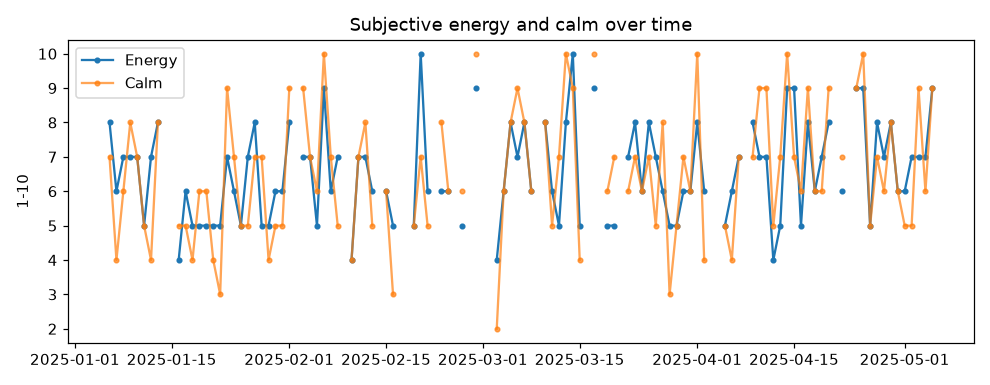
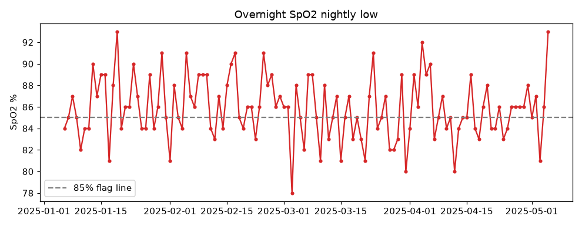

# Health analysis report

Window **2025-01-06 to 2025-05-05** (120 days). Days with a subjective energy rating: **99**.

> Single subject (n=1), modest sample, many simultaneous variables. Spearman rank correlations with a permutation p-value; treat as directional, not proof.

## Headline findings

- Strongest same-day correlate of felt energy is **calm** (rho +0.72, n=99) — consistent with stress/calm being the main lever the watch can't directly see.
- Garmin recovery metrics (HRV, sleep score, Body Battery) barely track felt energy (all |rho| <= 0.08). The watch measures recovery, not fatigue.
- Prior-day movement shows no meaningful next-day recovery benefit (all |rho| <= 0.13).

## Descriptives

| Metric | min | median | max | n |
|---|---|---|---|---|
| Subjective energy (1-10) | 4 | 6 | 10 | 99 |
| Calm (1-10) | 2 | 6 | 10 | 99 |
| Mood (1-10) | 4 | 7 | 10 | 99 |
| HRV last night (ms) | 25 | 47 | 70 | 120 |
| Body Battery recharge | 25 | 53 | 94 | 120 |
| Sleep score | 52 | 76 | 100 | 120 |
| Garmin stress (avg) | 5 | 31 | 59 | 120 |
| Steps | 446 | 6140 | 12017 | 120 |

## Same-day correlations

| Variable | Outcome | rho | n | p (perm) | |
|---|---|---|---|---|---|
| calm | energy | +0.72 | 99 | 0.000 | **sig.** |
| stress_subj | energy | -0.72 | 99 | 0.000 | **sig.** |
| garmin_stress | energy | -0.63 | 99 | 0.000 | **sig.** |
| sleep_quality_subj | energy | +0.10 | 99 | 0.310 |  |
| sleep_score | energy | +0.08 | 99 | 0.433 |  |
| hrv | energy | +0.03 | 99 | 0.773 |  |
| bb | energy | +0.03 | 99 | 0.766 |  |
| intensity | energy | -0.22 | 99 | 0.032 | **sig.** |
| garmin_stress | hrv | +0.10 | 120 | 0.263 |  |
| hrv | mood | -0.08 | 99 | 0.443 |  |
| calm | mood | +0.71 | 99 | 0.000 | **sig.** |

## Lagged correlations (prior day -> next day)

| Variable | Outcome | rho | n | p (perm) | |
|---|---|---|---|---|---|
| calm | energy | -0.03 | 81 | 0.803 |  |
| stress_subj | energy | +0.03 | 81 | 0.803 |  |
| intensity | bb | -0.13 | 119 | 0.150 |  |
| intensity | hrv | -0.08 | 119 | 0.400 |  |
| activity_load | bb | -0.12 | 32 | 0.509 |  |
| steps | bb | -0.05 | 119 | 0.539 |  |
| sleep_score | energy | +0.16 | 98 | 0.106 |  |
| bb | energy | +0.09 | 98 | 0.363 |  |
| hrv | energy | +0.02 | 98 | 0.841 |  |

## Trend (first half vs second half)

| Metric | First half | Second half | Δ |
|---|---|---|---|
| Steps/day | 7064.2 | 5582.1 | -1482.1 |
| Intensity min/day | 25.0 | 18.7 | -6.2 |
| HRV | 46.8 | 46.6 | -0.2 |
| Body Battery recharge | 56.5 | 56.6 | +0.1 |
| Subjective energy | 6.3 | 6.8 | +0.6 |

## Natural-experiment window

Peak 7-day HRV window ends 2025-03-12.

| Metric | Peak week | Baseline |
|---|---|---|
| HRV | 55.4 | 46.4 |
| Energy | 6.7 | 6.3 |
| Calm | 7.2 | 6.1 |

_A higher-HRV stretch that does not line up with higher felt energy is evidence HRV is not a day-to-day wellbeing gauge for this subject._

## Overnight oxygen

Overnight SpO2 (`sleep_spo2_lowest`), 120 nights: median lowest **86%**, floor **78%**. Nights with a nadir <=85%: **57** (48%); <=82%: 13; <=80%: 3. (Wrist pulse oximetry over-reads lows; a recurring pattern is still worth flagging clinically, not diagnosing.)

## Charts

